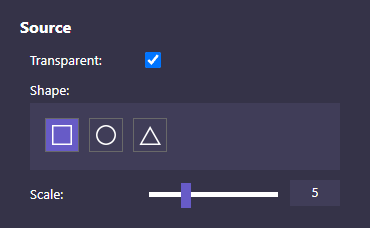
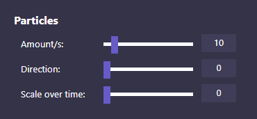
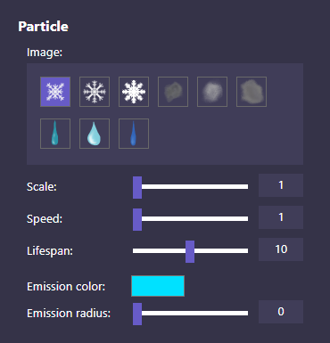

# Particle Generator

This application does not serve any specific purpose. It was made just for fun and to show off my React skills. 

Live example: https://marcsikora.github.io/projects/particle-generator/

In order to understand how the app works, please watch short Preview below.

## Preview

https://user-images.githubusercontent.com/93472358/141620347-52b50789-f0e7-47b5-bd3c-64df268f3fc1.mp4

## Structure

**Main Buttons** - buttons for main operations (in order from left to right):

* **Play/Pause** - controls whether particles should be generating/moving
* **Add particle system** - adds new ParticleSystem to display
* **Add object** - adds new Object2D to display
* **Toggle names** - shows/hides objects names
* **Toggle gizmos** - shows/hides objects gizmos

**Show/Hide UI** - shows/hides UI with the exception of PropertiesList and bottom bar

**Github link** - link to app's repository

**Manual** - simple manual

**Info** - displays current amount of Objects2D and ParticleSystems

**Properties List** - list of editable properties of selected object

## Manual

| Key | Description |
|-----|-------------|
| **LMB** | grab/move/select object |
| **D** | duplicate object |
| **X** | remove object |
| **W** | move object layer up |
| **S** | move object layer down |

## Background Properties

| Property name | Description |
|---------------|-------------|
| **Color** | changes background color |
| **Image** | changes background image |

## Object2D Properties

### General

| Property name | Description |
|---------------|-------------|
| **Type** | changes object's type(image) |
| **Scale** | changes object's scale |

## Object2D Properties

### General

| Property name | Description |
|---------------|-------------|
| **Type** | changes object's type(image) |
| **Scale** | changes object's scale |

## ParticleSystem Properties

### Source

| Property name | Description |
|---------------|-------------|
| **Transparent** | if checked, ParticleSystem source is transparent |
| **Shape** | source's shape |
| **Scale** | source's scale |

### Particles

| Property name | Description |
|---------------|-------------|
| **Amount/s** | amount of particles generated per 1 second |
| **Direction** | direction of particles movement (measured in degrees) |
| **Scale over time** | change factor of particles scale over time |

### Particle

| Property name | Description |
|---------------|-------------|
| **Image** | particle's image |
| **Scale** | particle's scale |
| **Speed** | particle's speed |
| **Lifespan** | particle's lifespan (measured in seconds) |
| **Emission color** | particle's emission color |
| **Emission radius** | particle's emission radius (measured in pixels) |

## Examples

