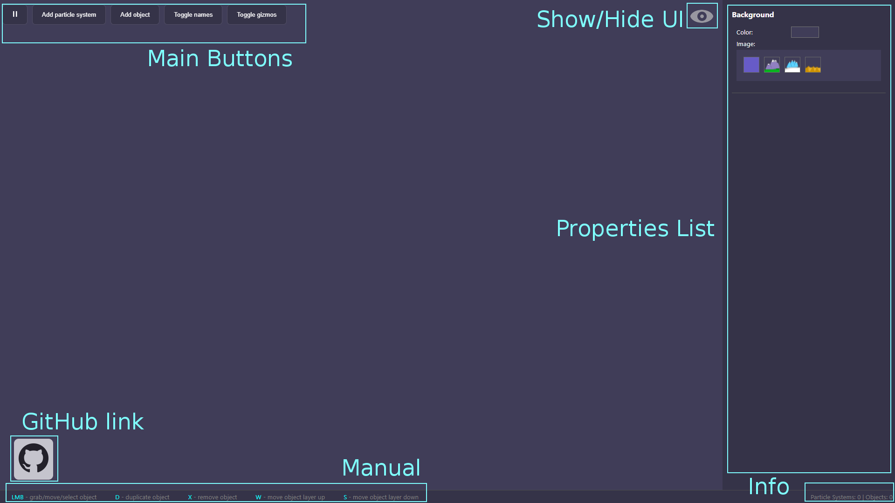

# Particle Generator

This application does not serve any specific purpose. It was made just for fun and to show off my React skills. 

In order to understand how the app works, please watch short Preview below:

## Preview

https://user-images.githubusercontent.com/93472358/141620347-52b50789-f0e7-47b5-bd3c-64df268f3fc1.mp4

## Structure

**Main Buttons** - buttons for main operations (in order from left to right):

* **Play/Pause** - controls whether particles should be generating/moving
* **Add particle system** - adds new ParticleSystem to display
* **Add object** - adds new Object2D to display
* **Toggle names** - shows/hides objects names
* **Toggle gizmos** - shows/hides objects gizmos

**Show/Hide UI** - shows/hides UI with the exception of PropertiesList and bottom bar

**Github link** - link to app's repository

**Manual** - simple manual

**Info** - displays current amount of Objects2D and ParticleSystems

**Properties List** - list of editable properties of selected object

## Manual

| Key | Description |
|-----|-------------|
| **LMB** | grab/move/select object |
| **D** | duplicate object |
| **X** | remove object |
| **W** | move object layer up |
| **S** | move object layer down |

## Background Properties

| Property name | Description |
|---------------|-------------|
| **Color** | changes background color |
| **Image** | changes background image |

## Object2D Properties

### General

| Property name | Description |
|---------------|-------------|
| **Type** | changes object's type(image) |
| **Scale** | changes object's scale |
